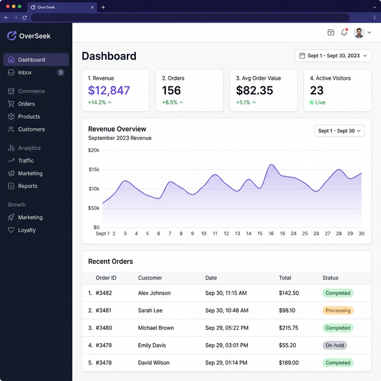
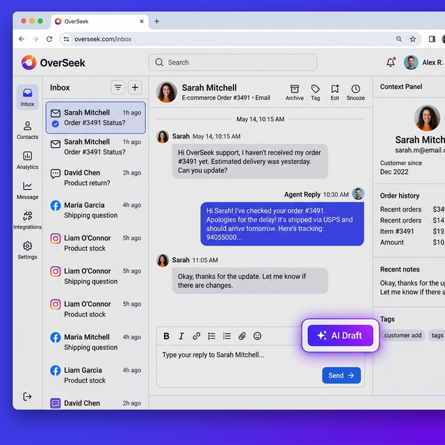
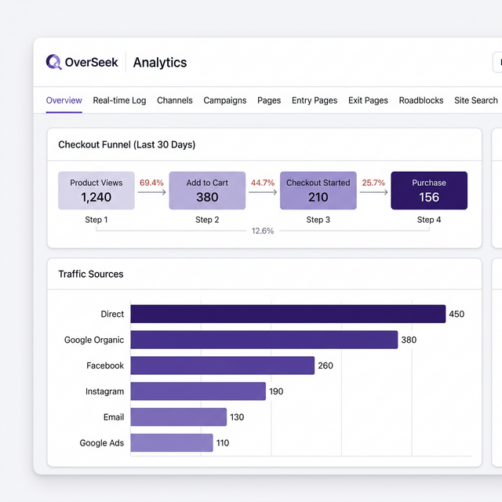
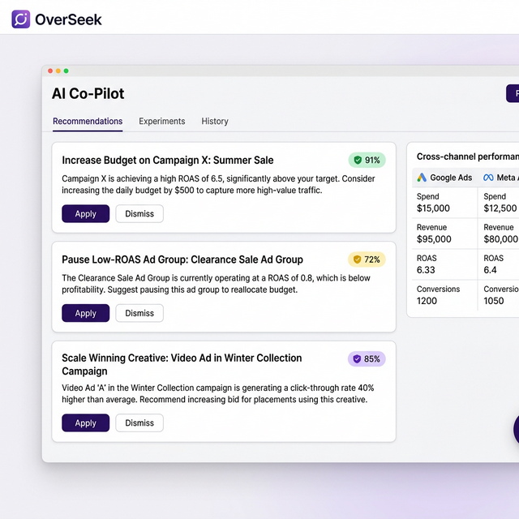
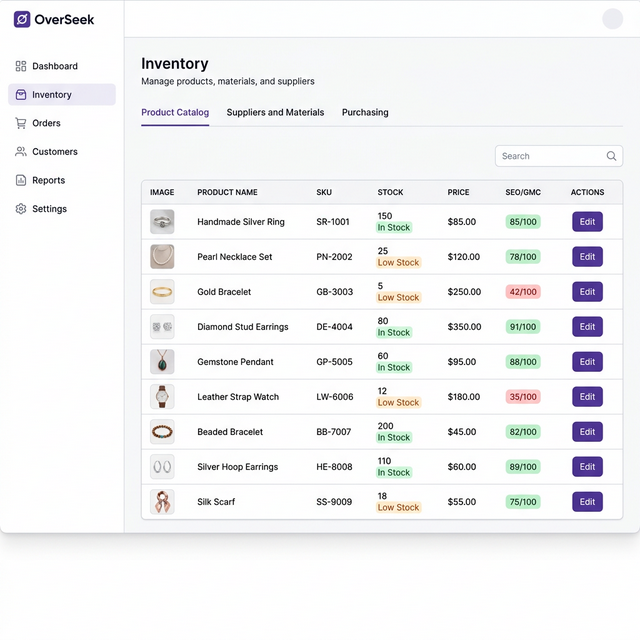
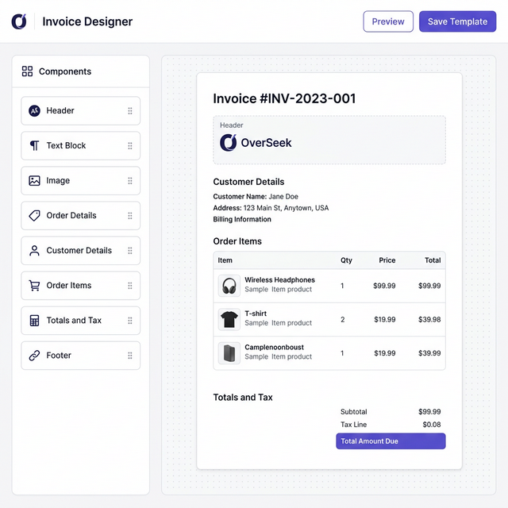

<p align="center">
  <h1 align="center">🚀 OverSeek</h1>
  <p align="center"><strong>Your Store's Command Center</strong></p>
  <p align="center"><em>Everything about your WooCommerce store. One dashboard. Zero monthly fees.</em></p>
</p>

<p align="center">
  
  
  
  
  
</p>

---

## 📸 Screenshots

<p align="center">
  
  
</p>
<p align="center">
  
  
</p>
<p align="center">
  
  
</p>

---

## What is OverSeek?

**OverSeek puts you back in control of your e-commerce data.**

If you run a WooCommerce store, you know the pain: Metorik for analytics ($79/mo), Crisp for chat ($75/mo), Klaviyo for emails ($45/mo), and a dozen other tools that barely talk to each other. That's $200+ per month, your customer data scattered across a dozen SaaS platforms, and no single source of truth.

OverSeek fixes that. It's a self-hosted dashboard that syncs with your WooCommerce store and gives you:

- 📊 **Real-time analytics** — See who's on your site right now, what's in their cart, and where they came from
- 💬 **Unified inbox** — Email, live chat, Facebook, Instagram—all in one place with AI-drafted replies
- 🤖 **AI marketing co-pilot** — Analyzes your ads across Google, Meta, and TikTok with confidence-scored recommendations
- 📦 **Inventory & warehouse** — Stock alerts based on sales velocity, BOM management, purchase orders, and picklists
- ⚡ **Marketing automation** — Abandoned cart flows, welcome series, post-purchase emails with visual flow builder
- 📧 **Business intelligence** — Daily/weekly email digests, customer cohort analysis, and product performance rankings
- 🔌 **MCP Server & CLI** — AI-friendly read-only store access via Model Context Protocol and terminal
- 🧾 **Invoice designer** — Drag-and-drop invoice builder with PDF generation
- 📱 **Progressive Web App** — Full mobile experience with push notifications and share target support

All running on your server. Your data never leaves your control.

---

## Quick Start (Docker)

The fastest way to get OverSeek running:

```bash
git clone https://github.com/MerlinStacks/overseek.git
cd overseek
docker network create proxy-net   # required once per host
bash setup.sh                      # generates stack.env with secure defaults
docker compose up -d
```

Wait for services to start (~2-3 minutes on first run), then open `http://localhost:5173`.

> **Requirements:** Docker and Docker Compose

<details>
<summary><strong>Manual setup</strong> (skip setup.sh)</summary>

```bash
cp stack.env.example stack.env
# Edit stack.env — set POSTGRES_PASSWORD, JWT_SECRET, ENCRYPTION_KEY
docker network create proxy-net   # required once per host
docker compose up -d
```

</details>

### First-Time Setup

After containers are running, open `http://localhost:5173` and register your account. **The first user to register automatically becomes the platform superadmin.** The onboarding wizard will guide you through connecting your WooCommerce store and optional integrations (email, ad accounts).

---

## Configuration

OverSeek is fully configurable via environment variables. Run `bash setup.sh` for guided setup, or copy `stack.env.example` to `stack.env` and customize:

### Required Settings

| Variable | Description | Example |
|----------|-------------|--------|
| `POSTGRES_PASSWORD` | Database password | `your-secure-password` |
| `JWT_SECRET` | Auth token secret (use `openssl rand -hex 32`) | `abc123...` |
| `ENCRYPTION_KEY` | Encryption key for secrets (use `openssl rand -hex 32`) | `def456...` |

### Deployment

| Variable | Description | Default |
|----------|-------------|---------|
| `APP_URL` | Frontend URL | `http://localhost:5173` |
| `APP_NAME` | Your application name | `OverSeek` |
| `CONTACT_EMAIL` | Notification/VAPID email | `notifications@localhost` |

> **Auto-derived:** `API_URL`, `CLIENT_URL`, `CORS_ORIGIN`, and `CORS_ORIGINS` are automatically derived from `APP_URL` at startup. You can override any of them in `stack.env` if you need a non-standard setup.

> **Note:** API keys and integrations (OpenRouter, Google Ads, Meta Ads, SMTP) are configured in the app UI, not via environment variables.

---

## Local Development

For contributors who want to run without Docker:

**Prerequisites:** Node.js 22+, PostgreSQL 16+, Elasticsearch 9+, Redis 7+

```bash
# Clone and install dependencies
git clone https://github.com/MerlinStacks/overseek.git
cd overseek
npm install

# Set up environment
cp stack.env.example stack.env
# Edit stack.env with your local database credentials

# Run database migrations
cd server && npx prisma migrate dev && cd ..

# Start development servers
npm run dev
```

Open `http://localhost:5173` for the frontend and `http://localhost:3000` for the API.

---

## Core Features

### 📊 Analytics & Tracking
See your store in real-time. Live visitors on a globe, add-to-cart events streaming in, abandoned carts flagged automatically. Works even with ad blockers (server-side tracking). Compatible with WooCommerce Blocks checkout and major caching plugins (LiteSpeed Cache, WP Super Cache, etc.). Includes checkout funnel analysis, entry/exit page tracking, site search analytics, and roadblock detection.

### 💬 Unified Inbox
One inbox for everything. Emails (via IMAP), live chat widget, Facebook messages, Instagram DMs. Canned responses with rich text support, AI-drafted replies, and conversation search. Multi-select conversation merge and full interaction history timeline.

### 🤖 AI Marketing Co-Pilot
Connect your Google Ads, Meta Ads, and TikTok Ads accounts. The AI analyzes your campaigns across 7, 30, and 90-day windows, spots trends, and gives you specific recommendations—with confidence scores so you know what to trust. Includes AI-powered ad copy generation, creative A/B experiment tracking, and proactive alerts for performance regressions. Stock-aware optimization automatically excludes out-of-stock items.

### 📈 Business Intelligence
Daily/weekly email digests land in your inbox with revenue, top products, and traffic sources. Customer cohort analysis shows which acquisition channels bring the best long-term customers. Product rankings reveal your winners and losers with multi-period trends (7d/30d/90d/YTD) and profit margin visibility.

### 📦 Inventory & Warehouse
Low stock alerts based on sales velocity (not just static thresholds). Bill of Materials for bundles and kits with circular-reference prevention. Purchase orders with supplier management. Picklists that optimize your warehouse walking path. SEO and Google Merchant Center health scores per product.

### 🛡️ Bot Shield
Browser fingerprinting at checkout blocks known crawlers and bots in real-time. Crawler management dashboard with live detection, whitelist/blacklist controls, and 24-hour blocked hit counters. Web Vitals collection for real-user performance monitoring.

### ⚡ Marketing Automation
Visual flow builder with drag-and-drop. Abandoned cart sequences, post-purchase follow-ups, welcome series. MJML-powered email templates that look great everywhere. Broadcast campaigns with audience segmentation.

### 🧾 Invoice Designer
Drag-and-drop visual invoice builder with components for headers, customer details, line items, totals, and custom text blocks. Dynamic data binding to order and customer data. PDF generation with synchronized preview-to-output layout.

### 👤 Customer Profiles
Full 360° view of every customer. Order history, lifetime value, all their conversations, every page they've visited, and marketing attribution. Customer segmentation for targeted campaigns.

### 📱 PWA & Mobile
Full Progressive Web App with push notifications (VAPID), share target support, and touch-optimized mobile views for orders, inventory, and customer profiles. Works on any device without app store distribution.

### 🔔 Notifications & Alerts
Centralized event-driven notification engine with in-app, web push (VAPID), and real-time Socket.IO delivery. Full diagnostic logging for 100% observability of all alerts.

---

## Tech Stack

| Layer | Technology |
|-------|------------|
| Frontend | React 19, Vite, TypeScript, Tailwind CSS v4 |
| Backend | Node.js 22, Fastify 5, Prisma 7 |
| Database | PostgreSQL 17 (pgvector), Elasticsearch 9, Redis 7 |
| AI | OpenRouter API (GPT-4, Claude, etc.) |
| Infrastructure | Docker Compose, GitHub Actions CI/CD, MCP |

---

## WooCommerce Integration

> **Important:** The WordPress plugin is **not standalone** — it connects your WooCommerce store to your self-hosted OverSeek server. You must set up the server first (see Quick Start above).

### Setup Steps:

1. **Start your OverSeek server** using Docker Compose
2. **Install the WordPress plugin** — copy the `overseek-wc-plugin` folder to your WordPress `wp-content/plugins` directory
3. **Activate the plugin** in WordPress Admin → Plugins
4. **Configure the connection** — Go to WooCommerce → OverSeek, paste the configuration JSON from your OverSeek dashboard

### What the Plugin Does:

- **Server-side tracking** — Pageviews, cart events, and purchases tracked directly from your server (ad-blocker proof)
- **WooCommerce Blocks compatible** — Works with both classic and block-based checkout
- **Cache-aware** — Automatically excludes tracking cookies from LiteSpeed Cache, WP Super Cache, and similar plugins
- **Live chat widget** — Optional chat bubble connecting customers to your OverSeek inbox
- **Email relay** — Allows OverSeek to send emails through your WordPress server's configured SMTP
- **Full data sync** — Orders, products, and customers sync bidirectionally via WooCommerce REST API

---

## Security

- **Argon2id** password hashing
- **JWT** with refresh token rotation
- **2FA** support (TOTP)
- **Rate limiting** built-in (configurable per endpoint)
- **Secure headers** via Fastify Helmet
- **Input sanitization** with DOMPurify (all user-generated HTML)
- **Encryption at rest** for stored credentials and API keys

---

## Project Structure

```
overseek/
├── client/              # React frontend
├── server/              # Fastify backend
├── overseek-wc-plugin/  # WordPress plugin
├── scripts/             # Utility scripts
├── docs/                # Documentation & screenshots
├── docker-compose.yml   # Infrastructure
├── setup.sh             # Guided setup (generates stack.env)
└── stack.env.example    # Environment variable reference
```

---

## Documentation

- [Changelog](./CHANGELOG.md) — What's new
- [Contributing](./CONTRIBUTING.md) — How to help
- [Deployment](./DEPLOYMENT.md) — Zero-downtime updates via Portainer

---

## Contributing

Found a bug? Want to add a feature? PRs welcome.

1. Fork it
2. Create your branch (`git checkout -b feature/cool-thing`)
3. Commit your changes
4. Push and open a PR

See [CONTRIBUTING.md](./CONTRIBUTING.md) for development environment setup and code style guidelines.

---

## License

MIT — do what you want with it.

---

<p align="center">
  <strong>Built for store owners who want control back.</strong>
  <br>
  <em>Your data. Your server. Your rules.</em>
</p>
