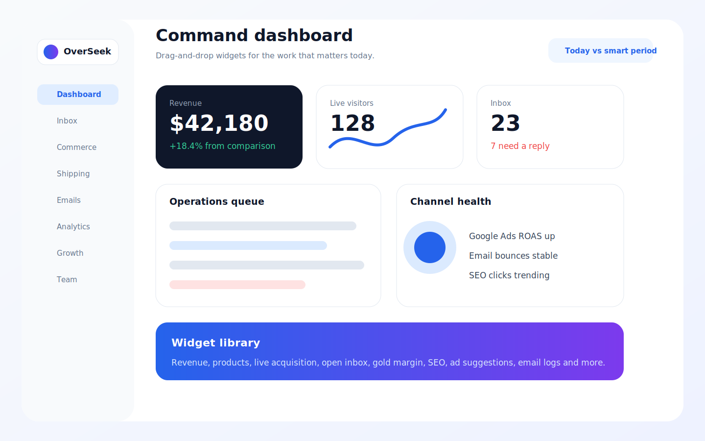
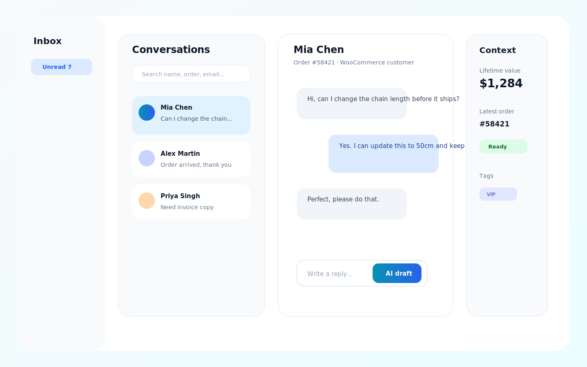
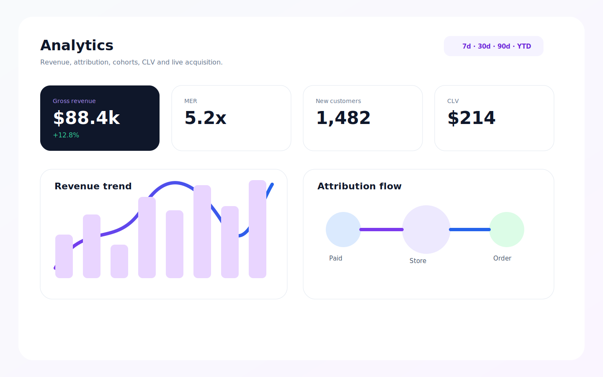
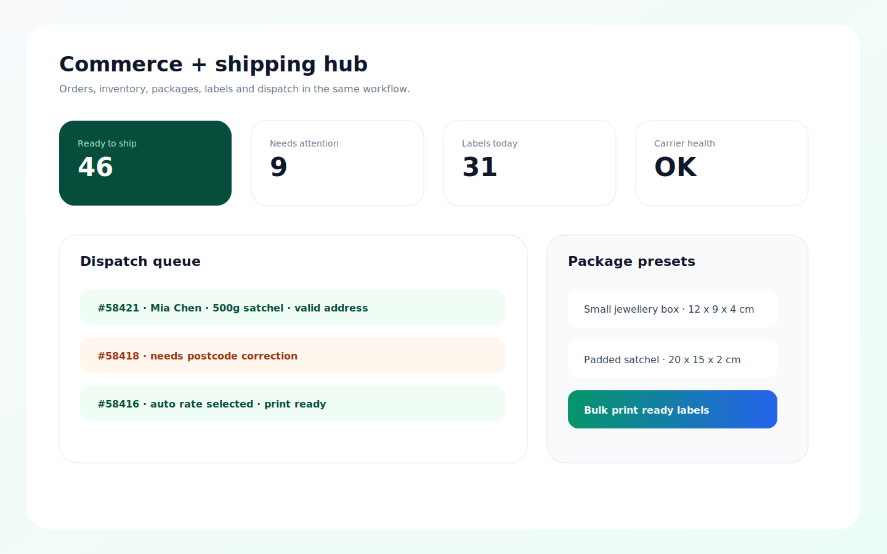
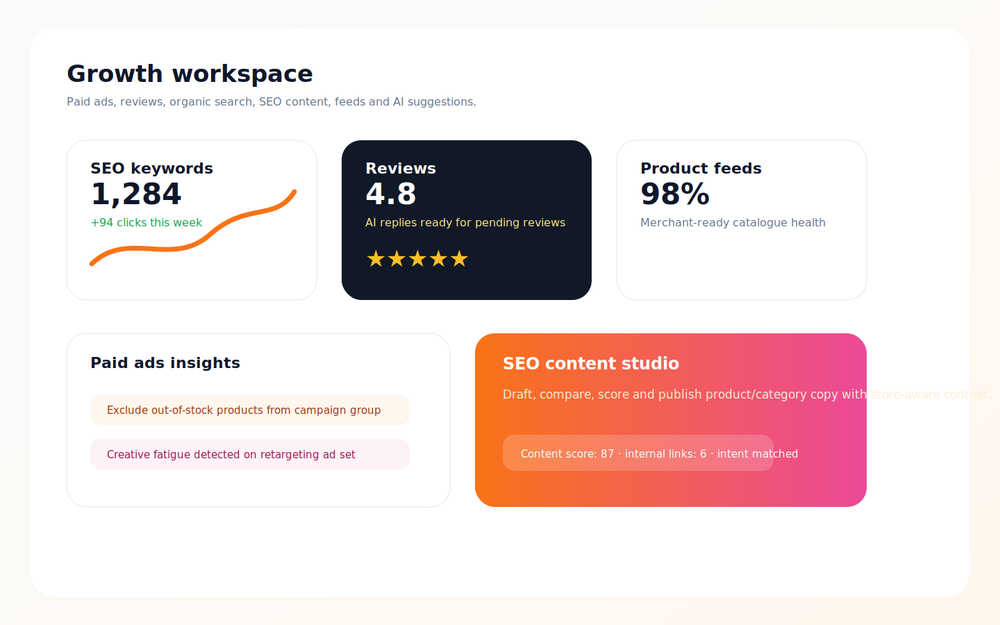
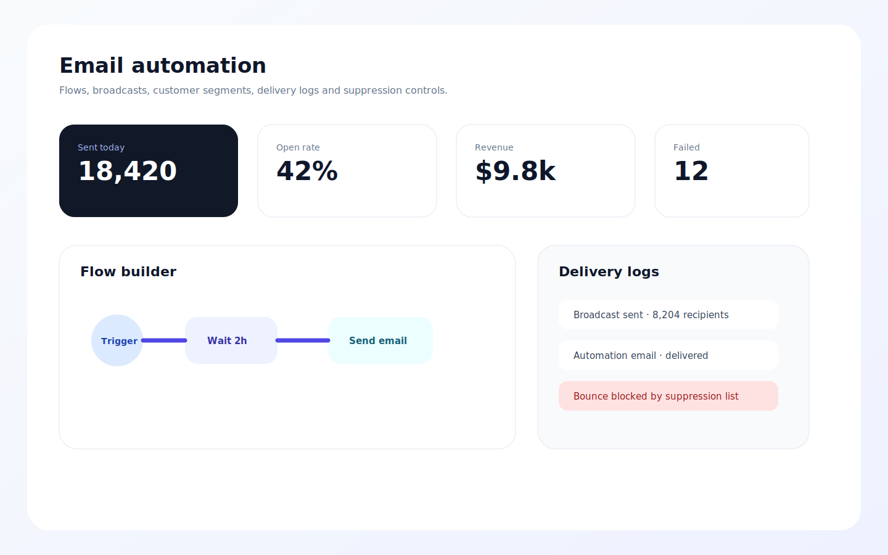

<p align="center">
  <h1 align="center">OverSeek</h1>
  <p align="center"><strong>Open-source eCommerce operations dashboard</strong></p>
  <p align="center"><em>Self-host your WooCommerce data, analytics, fulfilment, marketing, and customer operations in one private workspace.</em></p>
</p>

<p align="center">
  
  
  
  
  
</p>

## Screenshots

<p align="center">
  
  
</p>
<p align="center">
  
  
</p>
<p align="center">
  
  
</p>

## What Is OverSeek?

OverSeek is a self-hosted operations hub for WooCommerce stores. It syncs store data into your own PostgreSQL-backed application, adds real-time tracking and Socket.IO updates, and gives operators a single place to manage orders, inventory, shipping, customers, growth, analytics, and support.

It is built for teams that want practical ownership of their commerce data instead of spreading day-to-day operations across disconnected SaaS dashboards.

## Current Feature Set

- **Custom dashboard:** drag-and-drop widgets for revenue, live visitors, inbox status, product shortcuts, email health, SEO keywords, ads, and operational alerts.
- **Orders and abandoned carts:** WooCommerce order sync, order detail panels, fulfilment context, COGS, customer attribution, and abandoned-cart monitoring.
- **Inventory and supply chain:** product management, BOM sync, stock forecasting, purchase orders, supplier context, and product-level SEO/merchant health.
- **Shipping hub:** feature-gated shipping workspace for package presets, item overwrites, label history, dispatch operations, carrier settings, and print-agent workflows.
- **Inbox:** customer conversations, live chat, email-style replies, canned responses, AI draft assistance, unread state, attachments, and customer/order context.
- **Email marketing:** email hub, flows, broadcasts, customer segments, lists, suppression/blocked contacts, delivery logs, and email settings.
- **Analytics:** revenue, attribution, cohorts, CLV, reports, live acquisition views, crawler/bot shield, and conversion API health checks.
- **Growth:** paid ads, reviews, SEO keywords, SEO content tools, product feeds, and optional AI manager features.
- **Customers and team:** customer profiles, segmentation, role-based permissions, team management, policies/SOPs, help center, and superadmin tools.
- **Mobile PWA:** installed-app routes for dashboard, orders, inbox, analytics, inventory, customers, live visitors, notifications, profile, and settings.
- **Developer access:** shared core package, MCP server, CLI package, Docker Compose deployment, and WooCommerce connector plugin.

Some modules are account-feature gated, including email, shipping, feeds, AI manager, and bot shield.

## Quick Start

The fastest path is Docker Compose:

```bash
git clone https://github.com/MerlinStacks/overseek.git
cd overseek
docker network create proxy-net
bash setup.sh
docker compose up -d
```

Open `http://localhost:5173` once the stack is healthy. The first registered user becomes the platform superadmin.

Requirements: Docker and Docker Compose.

### Manual Environment Setup

```bash
cp stack.env.example stack.env
# Edit stack.env and set POSTGRES_PASSWORD, JWT_SECRET, and ENCRYPTION_KEY.
docker network create proxy-net
docker compose up -d
```

`APP_URL` controls the public frontend URL. The API URL and CORS values are derived automatically for the default local and deployed layouts, but can be overridden in `stack.env` when needed.

## Local Development

Prerequisites: Node.js 22+, PostgreSQL 17-compatible pgvector, Elasticsearch 9.x, and Redis 7+.

```bash
npm install
cp stack.env.example stack.env
cd server && npx prisma migrate dev --config ./prisma/prisma.config.ts && cd ..
npm run dev
```

Frontend: `http://localhost:5173`

API: `http://localhost:3000`

Useful scripts:

```bash
npm run dev
npm run db:migrate
npm run db:generate
npm run build:packages
npm run test -w server
npm run test:run -w client
```

## WooCommerce Integration

The WordPress plugin is not standalone. It connects WooCommerce to your self-hosted OverSeek server.

1. Start the OverSeek server.
2. Copy `overseek-wc-plugin` into `wp-content/plugins`.
3. Activate the plugin in WordPress Admin.
4. Paste the connection JSON from OverSeek into WooCommerce -> OverSeek.

The plugin handles server-side tracking, WooCommerce data sync, optional live chat, email relay support, checkout compatibility, and cache-aware tracking behaviour.

## Tech Stack

| Layer | Technology |
| --- | --- |
| Frontend | React 19, Vite 7, TypeScript, Tailwind CSS 4, React Query, Socket.IO client |
| Backend | Node.js 22, Fastify 5, Prisma 7, BullMQ, Socket.IO |
| Data | PostgreSQL 17 with pgvector, Elasticsearch 9, Redis 7 |
| Integrations | WooCommerce REST API, Google Ads, Search Console, SMTP/IMAP, web push, OpenRouter |
| Tooling | Docker Compose, npm workspaces, Vitest, GitHub Actions, MCP |

## Repository Layout

```text
overseek/
├── client/              # React dashboard and PWA routes
├── server/              # Fastify API, workers, Prisma schema, scripts
├── packages/            # Shared core, MCP server, CLI
├── overseek-wc-plugin/  # WordPress/WooCommerce connector plugin
├── print-agent/         # Local print agent for shipping workflows
├── docs/                # Documentation and README screenshots
├── docker-compose.yml   # Production-style service stack
├── setup.sh             # Guided stack.env generator
└── stack.env.example    # Environment reference
```

## Security Notes

- Passwords use Argon2id.
- JWT auth supports refresh-token rotation.
- TOTP 2FA is available.
- Stored credentials and API keys are encrypted at rest.
- Fastify Helmet, rate limiting, input sanitisation, and permission checks are built in.
- The deployment keeps PostgreSQL, Elasticsearch, and Redis off public host ports by default.

## Related Docs

- [WooCommerce plugin README](./overseek-wc-plugin/README.md)
- [Print agent README](./print-agent/README.md)

## License

MIT

<p align="center">
  <strong>Your store data. Your infrastructure. Your operating system.</strong>
</p>
